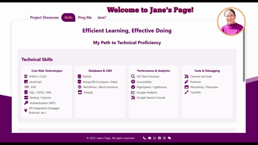
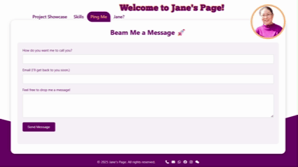

# Janeo0o Page

Welcome to my personal website project! This site was originally hosted at https://janeo0o.ct.ws, as a portfolio to showcase my projects and works.
When I tried SEO, I found that the speed was too slow, so I moved to GitHub.

## About the website

This website is built with **HTML**. Its features include:

- Personal introduction
- The portfolio shows my main projects of CertificateIII, CertificateIV and diploma during my TAFE study, static pages.
- External project links, among which A2z website search, sunnyspot, and sportswarehouse require database support.
- Later, I plan to add a blog section, and it is likely that the database will also be used.
  
## Interface preview

<p align="center">
  
  
  
</p>

## Technology

- Languages: HTML5, CSS3, JavaScript
- Use CSS to make the ellipse scroll and hide the part outside the field of view to achieve dynamic wave ripple effect. Use this as the background to increase the sense of agility.
- Use Formspree to achieve smooth email reception of web interactive information on the Ping Me page.
- Set all social software links available, especially WeChat, and use JavaScript to prompt customers to open WeChat and scan the code to add.

## Deployment

This project can be hosted on any server, such as InfinityFree, Cloudflare Pages, Netlify or Vercel, VentraIP.

## Project structure
<pre lang="markdown"> ``` 
Janeo0o/
├── index.html ← Home page
├── about.html
├── skills.html
├── contact.html
├── style.css ← Style file
├── images/ ← Folder for storing images
│ ├── janeo0o.png
│ ├── ...
│ └── jane.png
├──scripts/ ← JavaScript script
│ └── script.js
├── projects/ ← Portfolio subpage directory
│ ├── A2Z.html
│ ├── sportswhd.html
│ ├── Qualification.html
│ ├── xml.html
│ ├── shopping.html
│ ├── sunnyspot.html
│ ├── tiptoe.html
│ └── specialcakes.html
└── README.md ← Project Description Document``` </pre>
## License

This project is licensed under the [Creative Commons Attribution-NonCommercial 4.0 International License](https://creativecommons.org/licenses/by-nc/4.0/).
